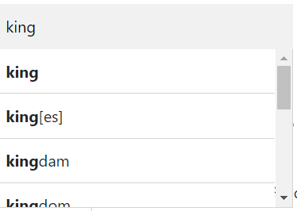
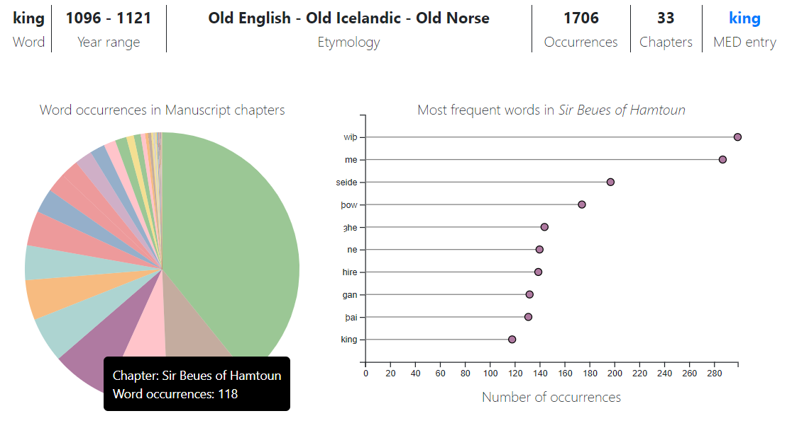
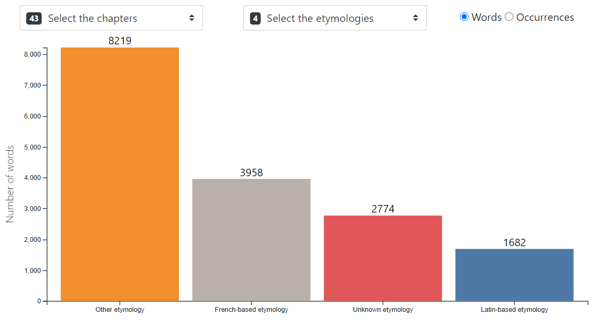

# AuchinleckDataViz

## Demo
https://solliryc.github.io/AuchinleckDataViz/

## Description
Le Auchinleck Manuscript est un recueil de poèmes produit à Londres dans les années 1330, qui fait office d'oeuvre de référence de la période du Middle English (env. de 1050 à 1500). Composé de 43 poèmes, le Auchinleck Manuscript donne de nombreuses informations sur l'état de la langue anglaise et la formation des dialectes à une époque où la langue anglaise n'était pas uniformisé.

Il est donc intéressant d'analyser de quelles étymologies viennent les mots présents dans l'ouvrage et à quel moment ces mots ont fait leur apparition dans la langue anglaise. De plus, le fait que le Auchinleck Manuscript soit composé de plusieurs textes distincts, d'auteurs différents, permet d'observer des différences entre l'un ou l'autre des poèmes.

## Données
La récupération des données nécessaires s'est effectuée en deux temps. D'abord, il a fallu récupérer les données concernant le Manuscript en isolant les mots qui composent ses textes (son lexique). Ensuite, il a fallu trouver pour chacun des mots du lexique ses données etymologiques et temporelles, au moyen du Middle English Dictionary, le dictionnaire de référence pour cette forme de la langue anglaise.

Il n'existe pas de fichier de données du Auchinleck Manuscript prêt à être analysé. Il a fallu donc utiliser la version numérisée en HTML du [Auchinleck Manuscript](https://auchinleck.nls.uk/), éditée par David Burnley et Alison Wiggins, a été mise en ligne en 2003. Cette version a été archivée [en format XML](https://ota.bodleian.ox.ac.uk/repository/xmlui/handle/20.500.12024/2493) par le Oxford Text Archive, un catalogue de contenu numérique littéraire et linguistique. A partir de ces fichiers XML, il a été possible d'extraire une liste de tous les mots uniques qui apparaissent dans le texte, soit un total de 16'673 mots.

Variables disponibles pour chaque mot:
* lexicon_word: la forme du mot tel qu'il apparaît dans le texte
* occurrences_manuscript: le nombre de fois que le mot apparaît dans tous les textes
* nbr_texts: le nombre de textes dans lequel le mot apparaît
* (poème): indique pour chaque poème, si le mot en fait partie (1 si oui, 0 si non)
* (poème)_occurrences: le nombre de fois que le mot apparaît dans chaque poème

Comme pour le Auchinleck Manuscript, il n'existe pas de fichier de données du Middle English Dictionary (MED) prêt à être analysé. Il a fallu donc récupérer les données à partir de la version numérique du [MED](https://quod.lib.umich.edu/m/middle-english-dictionary). Cette version du MED comporte plus de 54'000 entrées, qui sont homogènes au niveau de la mise-en-forme, mais pas uniformes au niveau du contenu. Certaines entrées ont des données étymologiques et temporelles, d'autres pas. Au total, 54'507 entrées du MED ont été extraites.

Variables disponibles pour chaque entrée:
* med_word: la forme du mot dans le dictionnaire
* year_1: l'intervalle durant lequel est apparu le mot
* year_from_1: la limite inférieure de l'intervalle durant lequel est apparu le mot
* year_to_1: la limite supérieure de l'intervalle durant lequel est apparu le mot
* (étymologie): indique pour chaque étymologie, si le mot en vient (1 si oui, 0 si non)

Une fois ces deux jeux données récupérés, il a fallu les mettre en commun

## Fonctionnalités
### Bar de recherche

La barre de recherche permet de voir les données disponibles pour chacun des mots du lexique du Auchinleck Manuscript. Le champ de recherche comporte une fonction de saisie semi-automatique. Il est possible de naviguer dans les suggestions soit avec les flèches du clavier et la touche <i>Enter</i> soit avec la souris.

La recherche d'un mot du lexique affiche 6 champs en-dessous de la barre:
* le mot
* l'intervalle durant lequel le mot est apparu dans le Middle English
* le ou les étymologies du mot
* le nombre de fois que le mot apparaît dans le manuscript
* le nombre de poèmes dans lequel le mot apparaît
* le lien vers l'entrée du mot dans le MED

### Distribution d'un mot dans les poèmes

La recherche d'un mot fait aussi apparaître un camembert (pie chart) en-dessous de la barre de recherche. Ce camembert indique le nombre de fois (occurrences) que le mot cherché apparaît dans chaque poème du Manuscript. En survolant un des arcs de cercle du camembert, une infobulle indique le titre du poème correspondant et le nombre d'occurrences.

### Mots les plus fréquents dans un poème

En cliquant sur un des arcs de cercle du camembert, un graphique lollipop (lollipop chart) apparaît sur la droite du camembert. Ce graphique indique les 10 mots les plus fréquents dans le poème séléctionné sur le camembert. Pour éviter d'afficher les mots les plus courants dans l'ensemble du Manuscript, les 30 mots les plus fréquents, qui apparaissent au moins dans 40 poèmes, ne sont pas pris en compte. En survolant avec la souris la "boule" au bout de chaque ligne du graphique, une infobulle indique le mot, le nombre d'occurrences dans le poème et le titre du poème.

### Distribution temporelle des mots, selon l'étymologie

### Décompte des mots, selon le poème et l'étymologie

## Discussion

## A propos
### Librairies utilisées
* Bootstrap 4.5.0
* D3 5.16.0
* JQuery 3.5.1
* Popper 1.16
* tail.select 0.5.15

### Sources
* [The Auchinleck Manuscript](https://auchinleck.nls.uk/) (eds: David Burnley and Alison Wiggins, National Library of Scotland, 2003)
* <a href="https://ota.bodleian.ox.ac.uk/repository/xmlui/handle/20.500.12024/2493" target='_blank'>The Auchinleck Manuscript on the Oxford Text Archive</a> (eds David Burnley and Alison Wiggins, National Library of Scotland, Oxford Text Archive, 2003)
* <a href="https://quod.lib.umich.edu/m/middle-english-dictionary" target="_blank">Middle English Dictionary</a> (eds: Frances McSparran, Ann Arbor, et al., University of Michigan Library, 2000-2018)

### Auteur
Ce projet a été réalisé par Cyrille Gay-Crosier dans le cadre du cours de Master <i>Visualisation de données</i>, donné par Loïc Cattani, au printemps 2020, à l'UNIL.
